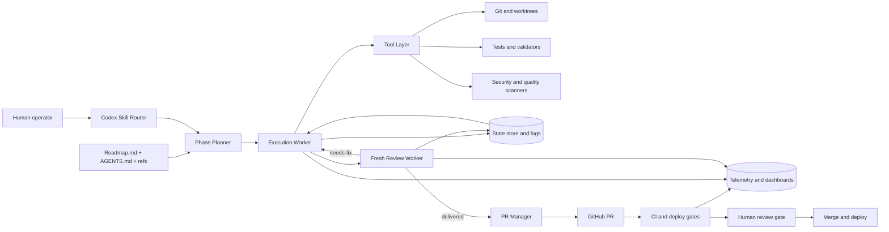
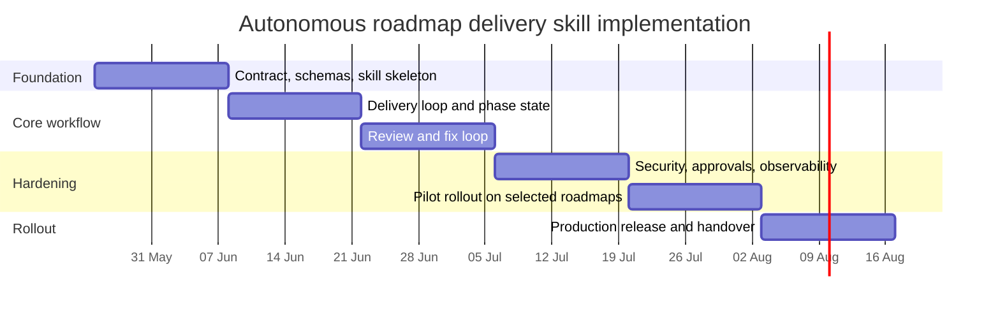

# Developing an Autonomous Phase-Gated Roadmap Delivery Skill for Codex

## Executive summary

The strongest design for this Codex skill is a **Codex-native, phase-gated workflow** rather than a large multi-agent swarm or a heavyweight external orchestration platform. That recommendation follows both the supplied workflow pattern and the current evidence base: Anthropic advises teams to start with simple, composable agentic patterns before adding framework complexity, while Google’s recent agent-scaling work shows that multi-agent coordination helps on decomposable tasks but can **degrade performance on sequential workflows** and amplify error propagation when coordination is weak. A roadmap-delivery loop is mostly sequential, stateful, and review-gated, so the default should be **one lead coding agent plus explicit verification and review gates**, not many loosely coordinated workers. citeturn21view0turn22view1

The skill should package the workflow contract into **Skills**, **AGENTS.md guidance**, and a small set of helper scripts, while keeping state in **repo-local artefacts** such as roadmap files, JSON state, append-only delivery logs, review files, and phase branches. That aligns well with how Codex skills are meant to work: a skill can bundle instructions, resources, and optional scripts; Codex uses progressive disclosure so only selected skills are fully loaded; and AGENTS.md files are layered from global to project scope before work begins. Codex also already supports the collaboration surfaces this workflow needs: review panes, worktrees, Git integration, GitHub PR review automation, approval policies, and sandbox controls. citeturn17view3turn18view0turn17view4turn17view2turn17view1

Quality control should be designed as **defence in depth**. The coding agent should be allowed to implement only the current phase; a verifier must run repository-local checks; a fresh review pass must inspect the delivered diff; security and quality scanners must run in CI; and a human reviewer must remain the final merge and deployment authority. This is consistent with Google’s secure-agent principles of well-defined human controllers, limited powers, and observable actions; with NIST’s SSDF and its generative-AI profile; with NCSC guidance that security must remain a core requirement across the entire AI system lifecycle; and with OWASP’s LLM risk model, especially prompt injection, insecure output handling, sensitive information disclosure, insecure plugin/tool design, and supply-chain vulnerabilities. citeturn22view0turn24view0turn24view1turn24view2turn24view4

A practical implementation plan is **six two-week sprints**, taking the skill from contract definition to pilot rollout and handover. A realistic staffing model is a compact cross-functional team: product/process owner, technical lead, Codex/prompt engineer, platform engineer, DevOps/security engineer, and QA/SDET. Total effort is approximately **40–45 person-weeks**, depending on how much CI/CD hardening and benchmark evaluation already exists. The primary technical risks are prompt injection, insecure code generation, test flakiness, uncontrolled autonomy, hidden state drift, weak review precision, and benchmark overfitting. Each of those can be mitigated with sandboxing, bounded tool access, private/held-out evals, reproducible state, branch protections, required reviewers, provenance attestations, and explicit rollback paths. citeturn17view1turn17view0turn24view4turn25view0turn24view6turn27view2

## Operating assumptions and target capability

The supplied brief and templates already define a strong operating model: a roadmap is the contract; only one phase may be delivered at a time; delivery must be followed by verification, a fresh review, a fix loop if required, per-phase commits and branches, final close-out artefacts, and explicit stop conditions. That is a sensible foundation, because long-running agents need durable state and resumability, and because roadmap delivery is closer to **workflow automation with bounded autonomy** than to open-ended autonomous exploration. Anthropic explicitly distinguishes predefined workflows from freer agents and recommends increasing complexity only when it is genuinely needed. citeturn21view0

For this report, I therefore assume the skill will be deployed in a **single primary repository**, using GitHub for pull requests and CI/CD unless otherwise specified, with Codex operating either locally or in Codex cloud but always against repository-scoped instructions and protected branch rules. I also assume the human organisation wants **autonomous execution within a phase**, but **human approval at merge and deployment boundaries**.

The target capability is:

> **A reusable Codex skill that can set up, run, inspect, pause, resume, review, repair, finalise, and hand over a phased roadmap delivery loop while keeping scope bounded to one phase, evidencing quality with tests and reviews, and preserving a clean audit trail.**

The main design choice is where orchestration and state should live.

| Approach | Summary | Strengths | Weaknesses | Fit for this use case |
|---|---|---|---|---|
| Prompt-only agent | A single long system prompt with no first-class state model | Lowest implementation cost; fast to prototype | Weak resumability; brittle review loops; poor auditability; high drift risk | Suitable only for experiments |
| **Codex-native skill with file-backed state** | Skill + AGENTS.md + repo-local JSON/log/review artefacts + Git branches | Best alignment with existing workflow; uses Codex-native skills, reviews, worktrees, sandboxes, and GitHub review hooks; low migration friction | Requires disciplined contract design and helper scripts | **Recommended default** |
| LangGraph-centred orchestration | External graph with persistence, HITL interrupts, and replay | Strong pause/resume semantics; explicit graph logic; good for service wrapping | Extra runtime and abstraction overhead; more plumbing than needed if Codex already drives the repo | Good if later exposed as a shared internal service |
| Temporal-centred orchestration | Durable workflow platform around Codex task invocations | Excellent reliability and long-lived resumability; strong operational semantics | Highest operational complexity; overkill for early rollout | Best only for multi-repo, enterprise-scale rollout |

This recommendation is evidence-based rather than stylistic. Anthropic advises simple composable patterns over unnecessary framework layers; Codex already exposes skills, project instructions, approvals, review panes, and Git-native iteration; LangGraph provides durable execution and human-in-the-loop pause/resume; and Temporal is explicitly designed for crash-proof long-running workflows. For a first production release, the Codex-native approach offers the best balance between **fit, control, and delivery speed**. citeturn21view0turn17view3turn18view0turn17view4turn26view0turn26view1turn26view2

A further architectural assumption matters: **do not default to many peer agents**. Google’s January 2026 work found that multi-agent systems can substantially improve parallelisable tasks, but they also degrade sequential tasks, raise coordination overhead, and can amplify errors unless constrained by a more central validation bottleneck. Roadmap delivery phases are usually sequential and tool-heavy, so if a second model-facing role is introduced, it should be a **reviewer or critic**, not a free-roaming co-planner. citeturn22view1turn22view2

## Requirements

The requirements below separate what the skill must do from how safely and reliably it must do it. The rationale comes from Codex’s native operating model, secure-agent guidance from Google, NIST’s SSDF and SP 800-218A, UK NCSC guidance, and OWASP’s LLM application risks. citeturn17view3turn17view1turn22view0turn24view0turn24view1turn24view2turn24view4

### Functional requirements

| ID | Requirement | Detail | Verification of the requirement |
|---|---|---|---|
| F-A | Roadmap ingestion | Parse a roadmap Markdown file, identify current phase, phase objective, acceptance criteria, non-goals, owned files, verification commands, and blockers. | Unit tests on parser against representative roadmap corpus; manual smoke test on at least five real roadmaps. |
| F-B | Phase scoping | Enforce “exactly one phase at a time”; reject or pause if the user prompt attempts to mix current and future phases. | Seeded red-team prompts that attempt phase skipping; must reject or pause in at least 95% of cases. |
| F-C | Skill-driven setup | Create or validate required automation artefacts: state JSON, delivery log, review directory, review/fix state, branch name, and close-out placeholders. | Integration test that starts with a clean repo and confirms all required artefacts are created correctly. |
| F-D | Delivery loop | Implement within current phase scope, using repository guidance and codebase conventions, then run required checks. | End-to-end task runs on held-out internal roadmap tasks. |
| F-E | Verification loop | Run declared verification commands and record pass/fail/not-run with evidence. A phase cannot be marked delivered if verification is absent or failing. | CI integration test and offline replay test. |
| F-F | Fresh review loop | Trigger a fresh-context review pass over the delivered diff, classify verdict as delivered / needs-fix / blocked, and store review findings. | Seeded-regression dataset with known defects; review loop should detect pre-seeded issues above target threshold. |
| F-G | Fix loop | If review verdict is needs-fix, apply bounded fixes without widening scope and re-run verification and review. | Replay on synthetic defect corpora and real pilot phases. |
| F-H | Git workflow control | Create or switch to a per-phase branch, commit only phase-bounded changes, and open or update a PR when configured. | Git integration tests with worktree and dirty-tree edge cases. |
| F-I | State and resumability | Persist current phase, branch, stage, review iteration count, last verification result, blockers, and timestamps so a run can resume after interruption. | Kill-and-resume tests; state-replay determinism tests. |
| F-J | Reporting and inspection | Answer status questions from state/log files, expose latest verification and review evidence, and summarise residual risks. | CLI/script tests and manual operator acceptance. |
| F-K | Finalisation | After all phases, prepare close-out artefacts, final branch, final deep-review prompt, and pause or hand off according to workflow policy. | Close-out checklist completion on pilot roadmap. |
| F-L | Recovery and rollback | Detect blocked or inconsistent runs, restore prior phase state from Git checkpoints, and provide an operator-readable recovery plan. | Fault-injection tests: failed verification, denied approvals, conflicting branch state, interrupted reviews. |

These functional requirements mirror the current workflow pattern while leveraging Codex’s actual affordances. Skills can package instructions, resources, and scripts; AGENTS.md can layer project-specific rules; Codex reads those instructions before work begins; and Codex cloud, local threads, and Git-native reviews provide natural execution surfaces for scoped delivery, review, and iteration. citeturn17view3turn18view0turn17view4turn17view6turn17view2

### Non-functional requirements

| Area | Requirement | Recommended target |
|---|---|---|
| Safety | Approval boundaries must exist for destructive actions, out-of-scope file writes, network access, and privileged tool calls. | No unrestricted destructive operations in default mode; approval policy `on-request` or stricter for production. |
| Security | Default operation must minimise network access, secret exposure, and untrusted output execution. | Network disabled by default; secret redaction in logs; allowlisted tools only. |
| Determinism and resumability | The workflow must be re-playable from persisted state without repeating unsafe side effects. | Resume from the latest safe checkpoint with no duplicate commits or duplicate external side effects. |
| Observability | Every run must emit logs, traces, metrics, and review outcomes. | 100% of production runs visible in dashboards and searchable logs. |
| Reliability | Interruption, retry, and denial handling must fail safe. | No silent phase advancement; no merge on failed required checks. |
| Auditability | Human reviewers must be able to reconstruct why a phase was accepted, blocked, or rolled back. | Immutable append-only logs plus linked PR, test, and review artefacts. |
| Performance | The skill should be operationally usable, not merely correct. | Median single-phase loop under 30 minutes for normal code phases; p95 clearly instrumented. |
| Maintainability | Prompt, skill, and workflow versions must be versioned separately from delivered roadmap content. | Versioned prompt registry and changelog for every production update. |
| Portability | Core logic should survive future migration from file-backed state to a service-backed control plane. | Storage abstraction layer and documented schema. |
| Data governance | Training and telemetry policies must be documented. | No accidental model-training opt-in for sensitive repo data; retention policy documented. |

The strongest justification for these qualities is external rather than internal. Codex’s default operation already combines sandbox mode and approval policy, with network access turned off by default and explicit controls on what the agent can technically do versus when it must stop to ask. Google’s secure-agent framework argues for human controllers, limited powers, and observable actions; NIST and NCSC require lifecycle security rather than one-off hardening; and OWASP highlights exactly the classes of failure that a roadmap-delivery skill can introduce if outputs are treated as trusted by default. citeturn17view1turn22view0turn24view0turn24view1turn24view2turn24view4

## Architecture and component design

The recommended architecture is a **single orchestrating Codex skill** wrapped around deterministic state artefacts and CI/CD controls. It should remain **repo-first and branch-first** rather than portal-first. The skill’s `SKILL.md` should stay short and route Codex into deeper reference material, because Codex skills are designed for progressive disclosure and the initial skills list has a context budget cap; long operational detail belongs in `references/` and helper scripts, not in the top-level skill manifest. citeturn17view3

At runtime, the system should behave like a **centralised, phase-local control loop**: the planner extracts the contract; the executor implements only current-phase changes; the verifier runs phase-defined checks; the reviewer inspects the diff in fresh context; and the state manager records every transition. This “single lead agent + reviewer” pattern is safer than a peer swarm for this task category, and it maps naturally to Codex’s approvals, review panes, GitHub review integration, and Git checkpoints. citeturn22view1turn17view2turn17view6



This design uses five logical data stores. First, the **roadmap contract** remains the authoritative statement of current scope. Secondly, the **repo-local automation store** contains `delivery_state.json`, `review_fix_state.json`, delivery and fix logs, and review artefacts. Thirdly, **Git history and phase branches** act as the main rollback substrate. Fourthly, **CI artefacts** hold verification evidence, scan outputs, and attestations. Fifthly, the **observability backend** stores traces, logs, metrics, and run metadata. That split preserves the current workflow while allowing future migration to SQLite or Postgres if cross-repo coordination becomes necessary. Codex itself already encourages Git checkpoints before and after tasks, which makes Git a natural rollback layer. citeturn17view6turn24view6turn26view3turn26view4

### Core modules and interfaces

| Module | Primary responsibility | Suggested interface |
|---|---|---|
| Skill router | Decide which reference section and scripts to load | `select_mode(task_text, repo_state) -> mode` |
| Phase planner | Parse roadmap and derive the current phase contract | `get_current_phase(roadmap_path) -> phase_contract` |
| State manager | Persist and validate finite-state transitions | `load_state()`, `transition(expected, next, evidence)` |
| Execution worker | Apply bounded changes for the current phase | `deliver_phase(phase_contract, workspace)` |
| Verifier | Run required repository and phase checks | `run_verification(commands, changed_files) -> evidence` |
| Review worker | Perform fresh-context review and verdicting | `review_diff(diff, rules) -> verdict, findings` |
| Fix worker | Apply review-driven repairs within scope | `apply_fixes(findings, scope)` |
| PR manager | Commit, branch, open/update PR, link evidence | `open_or_update_pr(run_id, branch, summary)` |
| Telemetry emitter | Emit traces, metrics, and logs | `emit(event_type, metadata)` |
| Recovery manager | Detect blocked/inconsistent state and generate rollback plans | `diagnose(run_state) -> recovery_actions` |

If the organisation later wants a service wrapper, expose these as internal APIs rather than burying them in prompts. A lightweight control plane would be sufficient:

```text
POST /runs                start roadmap execution
POST /runs/{id}/resume    resume latest safe checkpoint
POST /runs/{id}/review    force fresh review
POST /runs/{id}/rollback  revert to previous checkpoint
GET  /runs/{id}/status    return phase/state/evidence summary
POST /runs/{id}/closeout  run finalisation sequence
```

### Security model

Security should not rely on prompts alone. Codex separates **sandbox mode** from **approval policy**, and by default it runs with network access turned off; auto-review can route eligible approval prompts through a separate reviewer agent, but it is explicitly a **reviewer swap, not a permission grant**. It does not widen writable roots, enable network access, or weaken protected paths. The auto-reviewer is designed to block exfiltration of secrets and destructive, irreversible actions, and the current implementation includes a denial circuit breaker to stop escalation loops. citeturn17view1turn17view0

For this skill, the minimum secure operating profile should be:

| Control | Recommendation |
|---|---|
| Sandbox | `workspace-write` for normal delivery; `read-only` for status inspection and dry runs |
| Approval mode | `on-request` in pilot and production |
| Writable roots | Repo root plus automation artefact directory only |
| Network | Off by default; per-run allowlist for package install or external docs fetches |
| Tool policy | Allowlist `git`, file read/write, test runners, approved scanners, and helper scripts |
| Secret handling | Never write tokens, cookies, or credentials into logs or review files |
| Review boundary | Human approval required for merge, protected environment deployment, and any destructive tooling |

This matches external guidance. Google’s secure-agent principles call for tightly limited powers and observable planning; NCSC warns that prompt injection is a fundamental challenge rather than a solved variant of classic input sanitisation; and OWASP ranks prompt injection, insecure output handling, insecure plugin design, and sensitive information disclosure among the top LLM application risks. citeturn22view0turn4search0turn24view4

### Observability model

Agentic systems are hard to debug if you only retain final outputs. OpenTelemetry is the best neutral substrate because it standardises logs, metrics, and traces without imposing a vendor lock-in backend, and Google’s agent-observability guidance explicitly recommends tracking prompts, responses, tool usage, step latency, risky operations, and output quality. citeturn26view3turn26view4

Minimum telemetry fields should include: `run_id`, `roadmap_slug`, `phase_id`, `state_before`, `state_after`, `prompt_version`, `skill_version`, `changed_files`, `verification_result`, `review_verdict`, `review_iterations`, `token_count`, `runtime_seconds`, `approval_events`, `rollback_events`, and `human_reviewer_id`. This will support both operational debugging and eval generation later.

## Phased implementation roadmap

A six-sprint roadmap is enough to build, harden, and hand over a first production-quality skill without prematurely over-engineering it. The plan below assumes **two-week sprints** starting on **Monday 25 May 2026**. The early stages prioritise contract clarity and bounded behaviour; the middle stages add review, CI/CD, and security controls; and the final stages focus on pilot evidence and operational handover. This sequencing follows good agent-building practice: define the harness clearly, start evaluating early, and only deepen automation as the evidence becomes trustworthy. citeturn21view0turn21view2turn23view3

| Phase | Timing | Main deliverables | Acceptance criteria | Review gate | QA process | Rollback / mitigation |
|---|---|---|---|---|---|---|
| Foundation and contract | Weeks 1–2 | Skill skeleton, reference docs, roadmap parser, JSON schemas, state machine, operator assumptions, prompt registry | The skill can parse at least five representative roadmap files and generate valid initial state artefacts without editing code | Gate A: architecture and scope sign-off | Parser tests, schema validation, dry-run walkthrough | Revert to manual workflow; keep skill read-only |
| Core delivery loop | Weeks 3–4 | Current-phase extraction, bounded implementation loop, verification runner, branch/worktree handling, status inspection script | The skill can deliver a synthetic phase end-to-end on a dedicated branch and produce verification evidence | Gate B: functional demo | Integration tests with sample repo and dirty-tree scenarios | Disable auto-commit/PR; fallback to manual commit |
| Review and fix loop | Weeks 5–6 | Fresh review prompt, verdict classifier, review storage, fix-loop policy, max-review-iteration guard | Seeded defects are detected above agreed threshold and repaired within scope in at least 70% of pilot cases | Gate C: quality gate sign-off | Seeded-regression suite, replay tests, reviewer agreement study | Human review only; review loop downgraded to advisory mode |
| Security and observability hardening | Weeks 7–8 | Sandbox profile, approval policy, secret redaction, OTel instrumentation, CI integrations, branch protections, scanners | All runs emit logs/traces/metrics; merge is blocked on failing required checks; destructive actions require approval | Gate D: security review | Threat model review, denied-action tests, CI gate tests | Freeze approvals to strict human mode; disable external network |
| Pilot rollout | Weeks 9–10 | Pilot on 2–3 real roadmaps, dashboards, issue triage, fix backlog, close-out automation | At least two real roadmap phases complete with clean evidence and no uncontrolled scope expansion | Gate E: go/no-go for production | Human review of pilot transcripts, incident log review, rollback drills | Contain to pilot repos; revert to manual phase execution |
| Production rollout and handover | Weeks 11–12 | Runbooks, maintenance SOPs, release workflow, ownership transfer, KPI dashboard, prompt change policy | Named owners accept handover; release playbook and rollback plan exercised successfully | Gate F: production readiness | Operational acceptance test, close-out rehearsal, documentation review | Roll back to pilot-only availability; keep production skills disabled |



Two practical implementation notes matter. First, use **per-phase branches** throughout the build, because GitHub protected branches, required status checks, stale-review invalidation, and deployment gates all behave more predictably when phases are isolated. Secondly, wire the deployment path through **environments with required reviewers**, because GitHub environments can enforce manual approvals and prevent self-review before deployment jobs proceed. citeturn25view0turn25view2turn27view1

## Testing, evaluation, data and prompting

The evaluation strategy should treat this skill as an **agentic workflow system**, not just as a text-generation prompt. OpenAI’s production eval guidance frames evals as structured tests for variable systems; Anthropic recommends starting evals early, even with small sets; and its own multi-agent work emphasises end-state outcome evaluation rather than trying to prescribe one “correct path” through a complex tool trajectory. citeturn23view3turn23view4turn21view2

The most important lesson from recent coding-agent literature is that public benchmark scores are not enough. SWE-agent reached 12.5% pass@1 on SWE-bench in its 2024 report, and AutoCodeRover reported 19% on SWE-bench-lite, which is useful for calibration but not for release gating on your own repositories. More importantly, OpenAI now argues that SWE-bench Verified no longer adequately measures frontier coding ability because of contamination and flawed test cases, even though it was originally introduced as a human-validated subset. So public benchmarks should remain **secondary diagnostics**; release gates should rely mainly on **private, held-out, repo-relevant tasks and end-state checks**. citeturn12view0turn12view1turn13search2turn13search1

### Evaluation stack

| Layer | What it measures | Recommended method | Success threshold for production |
|---|---|---|---|
| Unit correctness | Parser, state machine, status transitions | Standard automated tests | 100% pass |
| Integration correctness | Git branch flow, review file creation, checkpoint resume | Containerised integration tests | 95%+ pass on nightly runs |
| End-to-end phase success | Can the system complete a real phase contract? | Held-out internal roadmap tasks | 80%+ of pilot tasks complete without uncontrolled scope expansion |
| Review effectiveness | Does fresh review catch seeded defects and missing checks? | Seeded regression corpus and reviewer agreement study | Precision ≥ 0.80, recall ≥ 0.70 on seeded issues |
| Safety compliance | Does the skill attempt disallowed actions? | Adversarial prompts and policy tests | 0 critical unauthorised actions |
| Recovery | Can interrupted runs resume cleanly? | Fault injection and replay | 95%+ successful recovery to latest safe checkpoint |
| Operational quality | Latency, cost, token use, review loop counts | Telemetry dashboards | Median normal phase < 30 minutes; review loops usually ≤ 2 |
| Human trust | Would reviewers merge what the system proposes? | Human-in-the-loop rubric | ≥ 4/5 average reviewer score across correctness, scope discipline, explainability |

### Automated test suite

The automated suite should include six families of tests. First, **contract tests** for roadmap parsing and state transitions. Secondly, **git/worktree tests** covering dirty working trees, pre-existing branches, stale review artefacts, and checkpoint reversion. Thirdly, **verification tests** ensuring required commands are executed and results are recorded faithfully. Fourthly, **seeded review tests**, where known defects are inserted into phase outputs to measure reviewer sensitivity. Fifthly, **security tests**, including prompt-injection attempts, hostile review comments, and malicious file content. Sixthly, **interruption/replay tests**, where the process is killed between delivery, verification, and review to ensure safe resumability. These priorities line up with durable-execution guidance from LangGraph, with Anthropic’s emphasis on tight feedback loops and observability, and with OWASP’s LLM threat model. citeturn26view0turn21view2turn24view4

### Human-in-the-loop review protocol

Human review should focus on the decisions automation is still bad at: scope appropriateness, product intent, architectural consequences, legal/compliance implications, and whether a superficially correct diff is actually fit to merge. GitHub protected branches already support required pull-request reviews, stale-review invalidation after additional pushes, code-owner review, status checks, and deployment-success gates. GitHub environments add required reviewers and prevent self-review for deployments. That makes GitHub a good final authority layer even if Codex performs an earlier automated review in the PR. citeturn25view0turn25view1turn25view2turn27view1

The recommended review protocol is:

1. **Machine review**: Codex or a dedicated review prompt inspects the diff and posts findings.
2. **Automated checks**: CI runs required tests, code scanning, dependency checks, and provenance steps.
3. **Human technical review**: a developer reviews the PR and the evidence bundle.
4. **Protected deployment review**: if the phase affects a deployment environment, an environment reviewer approves promotion.
5. **Post-merge spot audit**: one sampled phase per week is inspected retrospectively to catch silent failure modes.

Codex’s GitHub review integration is useful here, but it should remain a supplement rather than a substitute. In GitHub, Codex review is intentionally focused on **P0 and P1 issues**, and repo-specific review guidance can be supplied through `AGENTS.md`. That is exactly the right role for it: high-signal triage before human merge approval. citeturn17view2

### Datasets and evidence sources

| Dataset class | Purpose | What to include |
|---|---|---|
| Internal roadmap corpus | Primary release-gating evals | 30–50 past and current roadmap phases across different change types |
| Seeded defect corpus | Review and fix-loop measurement | Missing tests, scope leaks, insecure code patterns, documentation gaps |
| Resume/replay corpus | Recovery testing | Interrupted states at every lifecycle stage |
| Security corpus | Safe behaviour checks | Prompt injection attempts, hostile comments, unsafe shell suggestions, secret bait |
| Public directional benchmarks | Secondary model comparison only | SWE-bench family, HumanEvalFix-like tasks, secure-coding benchmarks |

Recent secure-code literature strengthens the case for a dedicated security corpus. The CodeLMSec benchmark, SafeGenBench, and Q&AEval all report that LLM-generated code remains susceptible to security flaws, and Veracode’s 2025 out-of-the-box testing across 100+ models found that AI-generated code frequently introduced known vulnerabilities. The implication for this skill is straightforward: never assume “code that passes tests” is safe enough; security scanning and targeted secure-coding evals must be part of the acceptance gate. citeturn28search1turn28search2turn28search3turn28search0

### Prompting and skill design

Prompting should be **outcome-first, contract-heavy, and minimal in surface area**. OpenAI’s current prompt guidance says newer GPT-5.x models generally respond better to shorter, outcome-oriented prompts than to process-heavy legacy stacks, while Codex-specific guidance strongly emphasises autonomy, persistence, careful codebase exploration, tool discipline, and bias toward completing the requested change rather than stopping at planning. citeturn23view1turn20view0

A good prompt hierarchy for this skill is:

1. **Persistent repo guidance** in `AGENTS.md`  
2. **Skill selection and routing** in `SKILL.md`  
3. **Mode-specific references** such as setup, deliver, review, recover  
4. **Run-local prompt** that injects the current phase contract and evidence requirements

Sample `AGENTS.md` sections should include:

```markdown
## Repository expectations
- Never advance a roadmap beyond its current phase.
- Run all required verification commands before proposing a phase as delivered.
- Treat review findings as authoritative unless they are demonstrably out of scope.
- Do not widen scope to future phases.
- Do not write secrets, tokens, cookies, or credentials into logs or review files.

## Review guidelines
- Flag missing tests for changed behaviour as P1.
- Flag logging of secrets, PII, or credentials as P0.
- Flag undocumented public-interface changes as P1.
```

That structure closely matches Codex’s official instruction-discovery model, where AGENTS files are layered from global to repo to deeper directories, with later directories overriding earlier guidance. citeturn18view0

A run-local delivery prompt can remain compact:

```text
Deliver only the current roadmap phase.

Before editing:
- Extract the current phase objective, acceptance criteria, non-goals, and required verification.
- List the files you expect to touch.
- Refuse to start any later phase.

After editing:
- Run verification.
- Summarise evidence.
- Trigger fresh review.
- If review says needs-fix, fix only within current phase scope.
- Mark delivered only if verification passed and review verdict is delivered.
```

A fresh reviewer prompt should be a separate template:

```text
Review the delivered diff in fresh context.

Judge only:
- correctness against the current phase contract
- tests and verification sufficiency
- security regressions
- scope leaks into future phases
- documentation / migration obligations introduced by the diff

Return exactly one verdict:
delivered | needs-fix | blocked
```

### Training and fine-tuning strategy

For this skill, the primary optimisation path should be **prompt, skill, and harness improvement**, not immediate fine-tuning of the coding model. OpenAI’s current platform guidance emphasises datasets, graders, and eval-driven iteration, but it also notes that the fine-tuning platform is being wound down for new users, and current reinforcement fine-tuning support is constrained to reasoning models rather than Codex as the main coding workhorse. The practical conclusion is to keep the “workflow intelligence” in **skills, AGENTS.md, scripts, and evals**, and use fine-tuning only for specialised supporting models if necessary. citeturn23view3turn23view5turn23view6turn23view2

| Customisation route | Best use | Recommendation |
|---|---|---|
| Prompt and skill engineering | Workflow control, policy adherence, codebase conventions | **Primary path** |
| Dataset-backed prompt optimisation | Tightening prompts against real failures and annotations | **Use early and often** |
| Supervised fine-tuning | Stable format/style tasks on adjunct models | Use only if a support model handles classification or summarisation |
| Reinforcement fine-tuning | Clear, guess-proof scoring with expert grader agreement | Reserve for specialist reviewer/judge models, not first release |

Data requirements for the optimisation flywheel should include: 30–50 labelled phase runs from pilots; at least 100 seeded review findings with expected verdicts; resume/recovery traces; and a registry of prompt versions linked to success/failure outcomes. OpenAI’s prompt optimiser can use datasets, grader results, and human annotations to improve prompts, which makes it well-suited for improving review and recovery prompts even if you never fine-tune the base coding model. citeturn23view2turn23view3

## Delivery operations, risk, effort and handover

The operational delivery model should treat the skill as part of the **software supply chain**, not just part of the IDE experience. That means CI/CD, provenance, code scanning, dependency hygiene, and deploy approvals must be designed into the workflow. GitHub provides all the core primitives required here: reusable workflows, protected branches, required reviews, required status checks, environments with required reviewers and self-review prevention, Dependabot alerts, code scanning, and artifact attestations. Those primitives map cleanly to NIST SSDF, SLSA, and Sigstore/Cosign concepts for provenance and verifiability. citeturn27view0turn25view0turn25view2turn27view1turn10search2turn10search3turn24view6turn24view7turn27view2turn27view3

### CI/CD and deployment strategy

The recommended pipeline is:

1. **Feature branch per phase**
2. **PR opened or updated by the skill**
3. **Reusable CI workflows** run tests, linters, code scanning, dependency review, and documentation checks
4. **Codex review** runs as an additional high-signal reviewer where appropriate
5. **Human technical review** approves under branch protection
6. **Artifact attestation** is generated for produced binaries or images
7. **Staging deployment** executes behind an environment with a required reviewer
8. **Production deployment** occurs only from protected branches and only after required checks and approvals

That design is not optional ceremony. GitHub notes that required status checks, required reviews, code-owner review, stale-review invalidation, deployment-success requirements, and merge queues all materially reduce the chance of merging incompatible or unreviewed changes. GitHub artifact attestations establish verifiable provenance and can be combined with reusable workflows to reach stronger SLSA-aligned build integrity. Sigstore and Cosign then provide identity-bound signing and verification for release artefacts and images. citeturn25view0turn25view2turn27view0turn24view6turn24view7turn27view2turn27view3

A minimal reusable workflow layout should look like this conceptually:

```text
.github/workflows/
  roadmap-phase-ci.yml
  roadmap-phase-review.yml
  roadmap-phase-attest.yml
  deploy-staging.yml
  deploy-production.yml
```

`roadmap-phase-ci.yml` should be reusable via `workflow_call`, because GitHub’s reusable-workflow support allows centralised enforcement and also helps strengthen supply-chain controls by standardising trusted build instructions across repositories. citeturn27view0turn24view6

### Risk analysis and mitigation

| Risk | Why it matters | Mitigation |
|---|---|---|
| Prompt injection via files, comments, or docs | Can redirect the agent away from the roadmap contract | Treat all repo content as untrusted except explicit instruction channels; use AGENTS.md as authoritative; require review for risky tool calls |
| Insecure output handling | “Looks good” code may still be exploitable | Run code scanning, dependency review, security tests, and seeded secure-coding evals |
| Scope creep into later phases | Breaks roadmap contract and obscures review | Hard phase-boundary checks; reviewer flags future-phase work as blocking |
| Secret exfiltration or disclosure | Logs and PRs can become a leakage channel | Network off by default, secret-redaction middleware, no credential logging |
| State drift after interruption | Resuming from stale state causes duplicate or incoherent changes | Deterministic state machine, Git checkpoints, replay tests |
| Reviewer over-trust | Humans may rubber-stamp polished but wrong changes | Require evidence bundles and sampled retrospective audits |
| Benchmark overfitting | High public scores may hide weak repo-specific performance | Use private held-out tasks as release gates; public benchmarks only as directional signals |
| CI gate fatigue or flakiness | Teams start bypassing controls if checks are noisy | Keep gate set tight, measurable, and curated; maintain flaky-test SLO |
| Cost blowouts | Long-running coding agents can be expensive | Track token/runtime budgets and stop conditions; compare median/p95 by phase type |
| Vendor lock-in | Hard to migrate if orchestration is model-specific | Keep roadmap/state formats open and store observability in OpenTelemetry |

These mitigations are directly supported by current guidance. OWASP’s LLM Top 10 calls out prompt injection, insecure output handling, sensitive information disclosure, insecure plugin design, and supply-chain weaknesses. NCSC explicitly warns that prompt injection should be treated as a fundamental architectural issue, not something that can be “fully sanitised away.” Google’s secure-agent framework argues for limited powers and observability; NIST’s SSDF and AI profile require lifecycle security; and secure-code benchmarks continue to show that model output is not safe by default. citeturn24view4turn4search0turn22view0turn24view0turn24view1turn28search1turn28search2turn28search3turn28search0

### Estimated effort and resource plan

A realistic first-release staffing model is shown below.

| Role | Main contribution | Approximate effort |
|---|---|---|
| Product / process owner | Roadmap contract definitions, pilot acceptance, handover | 3–4 person-weeks |
| Technical lead / architect | Overall workflow design, security model, release gates | 5–6 person-weeks |
| Codex / prompt engineer | Skill authoring, prompt stack, review prompts, eval loops | 8–10 person-weeks |
| Platform / backend engineer | Parser, state machine, helper scripts, control-plane wrapper if needed | 8–9 person-weeks |
| DevOps / security engineer | CI/CD, branch protections, scanners, attestations, sandbox policy | 5–6 person-weeks |
| QA / SDET | Test harnesses, seeded defects, replay tests, pilot dashboards | 6–7 person-weeks |
| Release / operations support | Runbooks, dashboards, rollout coordination | 3–4 person-weeks |

**Total:** approximately **40–45 person-weeks**.

A helpful phase-wise planning split is:

| Phase | Person-weeks |
|---|---:|
| Foundation and contract | 6 |
| Core delivery loop | 8 |
| Review and fix loop | 8 |
| Security and observability hardening | 8 |
| Pilot rollout | 7 |
| Production rollout and handover | 5 |

### Handover and maintenance plan

A good handover is not just documentation; it is an **operable control system**. By the end of rollout, the receiving team should own:

- the skill repository or skill directory,
- the prompt and instruction registry,
- the roadmap/state JSON schema,
- the reusable CI workflows,
- the dashboards and alert thresholds,
- the rollback procedure,
- the quarterly review cadence for prompts, evals, and policies.

The first maintenance objective should be an **evaluation flywheel**. OpenAI’s current eval guidance and cookbook material both encourage using real traces, feedback, grader results, and prompt iterations to improve the harness rather than relying on static prompt writing. Anthropic similarly recommends starting with small, realistic eval sets and iterating quickly. In practice, every blocked phase, false review finding, missed defect, and rollback should become a labelled datapoint for the next prompt update or helper-script change. citeturn23view3turn19search2turn21view2

The maintenance rhythm should be:

| Cadence | Activity |
|---|---|
| Weekly | Review pilot/production metrics, flaky gates, notable blocked runs |
| Fortnightly | Triage prompt changes, review seeded-defect performance, rotate sampled audits |
| Monthly | Review branch-protection and approval policies, dependency/security posture |
| Quarterly | Rebuild held-out eval set, re-run security red-team, review benchmark drift and model changes |

Because the current workflow documents emphasise close-out discipline, the handover plan should also preserve the close-out checklist as a first-class operational artefact: roadmap header updates, lifecycle-consistent file naming, README link maintenance, stale-link scans, roadmap-specific verification before close-out, movement or relinking of automation artefacts, and backlog capture for follow-up items.

### Open questions and limitations

A few design choices remain assumptions rather than settled facts because the brief intentionally leaves some items unspecified:

| Topic | Current assumption | Impact if changed |
|---|---|---|
| SCM / CI platform | GitHub Actions and GitHub PRs | The design ports to GitLab or another platform, but gate implementation details change |
| Execution surface | Codex local/app or Codex cloud, repo-scoped | A fully remote multi-repo service would push the design closer to LangGraph or Temporal |
| Security boundary | Repository-local development with limited network | Highly regulated environments may require stricter air-gapped or hermetic builds |
| Benchmark policy | Private held-out tasks as primary; public benchmarks secondary | If a proprietary internal benchmark already exists, it should replace most public diagnostics |
| Fine-tuning appetite | Prompt/skill/eval-first, no Codex fine-tuning in first release | If a specialist reviewer model is acceptable, adjunct fine-tuning may later improve triage precision |

Overall, those uncertainties do **not** change the core recommendation. The right first release is still a **Codex-native, file-backed, phase-gated skill with explicit verification, fresh review, human merge authority, and strong CI/CD controls**. That design is the shortest path to autonomy that remains reviewable, recoverable, and governable. citeturn21view0turn17view3turn17view2turn17view1turn25view0turn24view6